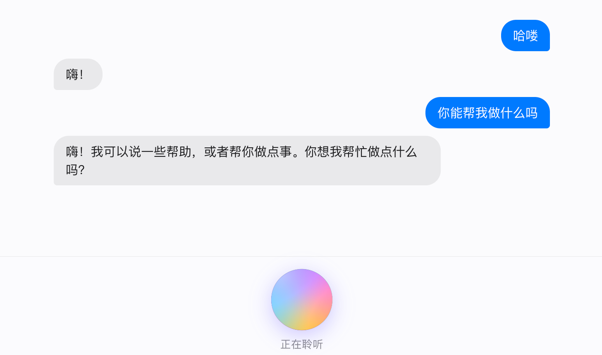

<div align="center">

# 🎙️ saam — Simple Audio Agent on Mac

**saam = Simple Audio Agent on Mac: Apple Silicon에서 MLX 풀 파이프라인으로 「말하기」를 「대답」으로 바꾸는 완전 로컬 음성 대화 에이전트**

[](https://www.python.org/)
[](https://ml-explore.github.io/mlx/build/html/index.html)
[](https://huggingface.co/mlx-community/whisper-large-v3-turbo)
[](https://huggingface.co/mlx-community/Qwen3-0.6B-4bit)
[](https://huggingface.co/mlx-community/Qwen3-TTS-12Hz-0.6B-Base-8bit)
[](https://github.com/tangquanwei/simple-audio-agent-on-mac/actions/workflows/ci.yml)
[](LICENSE)

🗣️ 말하기 → 🤖 생각하기 → 🔊 대답하기 · **클라우드 없이, API 키 없이, 구독 없이**

[English](README.md) · [中文](README.zh-CN.md) · [日本語](README.ja.md) · 한국어

[빠른 시작](#-빠른-시작) · [실시간 WebUI](#-실시간-webui) · [CLI](#-cli-대화) · [프로젝트 구조](#-프로젝트-구조) · [로드맵](#-로드맵)



</div>

---

## ✨ 특징

- 🔒 **완전 로컬**: STT, LLM, TTS가 모두 Mac에서 실행 — 음성은 기기 밖으로 나가지 않습니다
- ⚡ **MLX 엔드투엔드 가속**: 세 모델 모두 MLX 네이티브 추론, 통합 메모리에서 초급 응답
- 👂 **실시간 리스닝**: silero-vad가 발화 시작과 종료를 자동 감지 — **버튼을 누를 필요 없이** 잠시 멈추면 바로 대답
- 🌐 **두 가지 인터페이스**: 미니멀한 실시간 WebUI(브라우저에서 바로 대화) + 터미널 CLI, 같은 파이프라인 공유
- 🧩 **모듈화**: VAD / STT / LLM / TTS 네 개의 독립 모듈, 원하는 것만 교체 가능

## 🧠 작동 원리

```
🎤 마이크
   │
   ▼
┌─────────────┐   16kHz PCM, 0.8초 무음 시 자동 분할
│  silero-vad │
└─────────────┘
   │  하나의 완결된 발화
   ▼
┌─────────────────────┐
│  Whisper large-v3   │  📝 "오늘 날씨 어때?"
│      (turbo)        │
└─────────────────────┘
   │  텍스트
   ▼
┌─────────────────────┐
│    Qwen3-0.6B       │  💭 "맑아요. 산책하기 딱 좋겠네요."
│  (4bit, 스트리밍)    │
└─────────────────────┘
   │  응답 텍스트
   ▼
┌─────────────────────┐
│     Qwen3-TTS       │  🔊 자연스러운 음성
│   (12Hz, 8bit)      │
└─────────────────────┘
   │
   ▼
🔊 스피커 / 브라우저 재생
```

측정 지연 시간 (M5, 짧은 문장): **STT ~1.4s · LLM ~1.0s · TTS ~2.6s**

## 🚀 빠른 시작

> [!IMPORTANT]
> Apple Silicon Mac과 Python 3.12가 필요합니다(3.14 같은 최신 시스템 Python은 MLX에 너무 새롭습니다). [uv](https://docs.astral.sh/uv/) 사용을 권장합니다.

```bash
# 1. 환경 생성
uv venv --python 3.12 .venv

# 2. 의존성 설치
uv pip install --python .venv/bin/python -r requirements.txt

# 3. 실시간 WebUI 실행 (첫 실행 시 약 3GB 모델 자동 다운로드)
.venv/bin/python webui.py
```

<http://127.0.0.1:7860>을 열고 **「开始对话」(대화 시작)** 를 클릭한 뒤 그냥 말하세요 🎉

> [!NOTE]
> 처음 마이크를 사용할 때 macOS가 권한을 요청합니다. 터미널 / 브라우저 접근을 허용해 주세요.

## 🌐 실시간 WebUI

한 번 클릭하면 나머지는 VAD가 알아서 합니다:

- 🟢 **듣는 중** — 그냥 말하세요. 브라우저가 WebSocket으로 16kHz PCM을 계속 전송합니다
- 🟡 **인식 및 생성 중** — 약 0.8초 멈추면 서버가 세그먼트를 자르고 파이프라인을 시작합니다
- 🔊 **응답 재생 중** — 응답이 말풍선으로 표시되고 자동 재생됩니다. 재생 중에는 업로드를 일시 중지해 에이전트가 자기 목소리를 듣지 않습니다

여러 브라우저 연결을 지원하며, 추론 요청은 자동으로 큐잉됩니다.

## 💻 CLI 대화

```bash
.venv/bin/python main.py
```

말하기 → 전사 → 응답 출력 → 음성 재생이 반복됩니다. `Ctrl+C`로 종료.

명령어로 설치할 수도 있습니다 —— `uv pip install --python .venv/bin/python -e .` —— 이후 `saam`(CLI) / `saam-web`(WebUI)으로 실행하세요.

<details>
<summary>⚙️ 옵션 (webui.py와 main.py 공통)</summary>

| 플래그 | 기본값 | 설명 |
| --- | --- | --- |
| `--stt-model` | `mlx-community/whisper-large-v3-turbo` | 음성 인식 모델 |
| `--llm-model` | `mlx-community/Qwen3-0.6B-4bit` | 대화 모델 |
| `--tts-model` | `mlx-community/Qwen3-TTS-12Hz-0.6B-Base-8bit` | 음성 합성 모델 |
| `--voice` | `serena` | TTS 음색 |
| `--language` | `zh` | 인식 언어 |
| `--host` / `--port` | `127.0.0.1` / `7860` | WebUI 리슨 주소 |

</details>

## 🧪 단계별 검증

각 단계마다 독립 스크립트가 있어 문제를 쉽게 격리할 수 있습니다:

```bash
.venv/bin/python scripts/verify_tts.py   # TTS: 문장 합성 → out.wav 저장 후 재생
.venv/bin/python scripts/verify_stt.py   # STT: out.wav 전사 → 텍스트 출력
.venv/bin/python scripts/verify_llm.py   # LLM: 대화 한 라운드 실행
```

## 📁 프로젝트 구조

```
main.py              # CLI 엔트리: VAD 녹음 → STT → LLM → TTS → 재생 루프
webui.py             # 실시간 WebUI: FastAPI + WebSocket, 동일 파이프라인
saam/
  vad.py             # VADSegmenter(스트리밍 분할) + MicVAD(마이크 래퍼)
  stt.py             # mlx-whisper 래퍼
  llm.py             # mlx-lm 래퍼: 멀티턴 대화, 스트리밍 출력
  tts.py             # mlx-audio Qwen3-TTS 래퍼
scripts/             # 각 단계 독립 검증 스크립트
requirements.txt     # 고정된 의존성 (uv pip freeze)
```

## 🛠️ 기술 스택

| 단계 | 솔루션 | 모델 |
| --- | --- | --- |
| VAD | [silero-vad](https://github.com/snakers4/silero-vad) (ONNX, onnxruntime 추론) | 내장 |
| STT | [mlx-whisper](https://github.com/ml-explore/mlx-examples/tree/main/whisper) | `whisper-large-v3-turbo` |
| LLM | [mlx-lm](https://github.com/ml-explore/mlx-lm) | `Qwen3-0.6B-4bit` |
| TTS | [mlx-audio](https://github.com/Blaizzy/mlx-audio) | `Qwen3-TTS-12Hz-0.6B-Base-8bit` |

> [!TIP]
> 실전에서 발견한 두 가지 함정은 이 프로젝트에서 이미 해결했습니다: Qwen3는 기본적으로 `<think>` 추론 과정을 출력합니다(TTS가 생각 내용까지 읽어버림) — `enable_thinking=False`로 비활성화. lightning-whisper-mlx 0.0.10은 mlx 0.32와 호환되지 않아 STT는 공식 유지 관리되는 mlx-whisper를 사용합니다.

참고 프로젝트: [huggingface/speech-to-speech](https://github.com/huggingface/speech-to-speech)

## ❓ 자주 묻는 질문

**어떤 언어를 지원하나요?**
인식 측 Whisper는 다국어를 지원합니다 — `--language en`, `ja`, `ko` 등으로 전환하세요(기본값 `zh`). LLM(Qwen3)과 Qwen3-TTS는 중국어·영어에서 가장 안정적입니다.

**에이전트가 "생각 내용"까지 읽어요.**
Qwen3는 기본적으로 `<think>` 추론을 출력하지만, saam은 `enable_thinking=False`로 비활성화했습니다. 다른 추론 모델로 교체할 경우 TTS에 전달하기 전에 생각 태그를 제거하세요.

**첫 실행이 매우 느려요.**
최초 한 번만 모델(약 3GB)을 다운로드하기 때문입니다. 이후 시작은 몇 초면 됩니다. HuggingFace가 느리면 `HF_ENDPOINT=https://hf-mirror.com`을 설정해 보세요.

**마이크가 반응하지 않아요.**
시스템 설정 → 개인 정보 보호 및 보안 → 마이크 에서 터미널과 브라우저를 허용하세요. 브라우저 마이크는 `localhost` / `127.0.0.1`(또는 HTTPS)로 접속해야 합니다.

**7860 포트가 "Address already in use"?**
`--port 7861`로 변경하거나 `lsof -nP -iTCP:7860 -sTCP:LISTEN`으로 남은 프로세스를 확인하세요.

## 🗺️ 로드맵

- [x] 환경: uv + Python 3.12 venv
- [x] VAD: silero-vad 실시간 음성 분할
- [x] STT / LLM / TTS 단계별 검증
- [x] 통합: 녹음 → STT → LLM → TTS → 재생 루프 대화
- [x] 실시간 WebUI (WebSocket 스트리밍 + 자동 분할)
- [ ] barge-in: 응답 재생 중 사용자 끼어들기 감지 ([#1](https://github.com/tangquanwei/simple-audio-agent-on-mac/issues/1))
- [ ] TTS 생성과 동시에 재생(`stream=True`)으로 첫 음 지연 단축 ([#2](https://github.com/tangquanwei/simple-audio-agent-on-mac/issues/2))
- [ ] CustomVoice 모델: 더 다양한 음색과 감정 지시 ([#3](https://github.com/tangquanwei/simple-audio-agent-on-mac/issues/3))

---

<div align="center">

🍎 Made with MLX on Apple Silicon · 당신이 말하는 모든 말은 당신의 기기 안에만 머뭅니다

</div>
